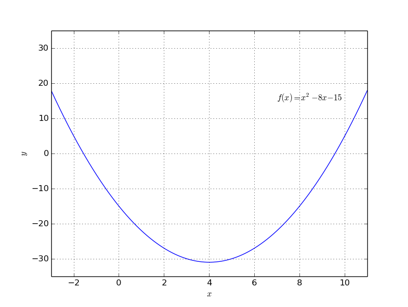

Diskriminante
=============

.. only:: html

    .. sidebar:: Hinweis

        Das Original dieser Maxima-Beispielaufgabe kann im Original `hier
        <http://www.lungau-academy.at/wxmax1001/D1010_F_AG_Diskriminante_einer_quadratischen_Gleichung.wxmx>`_
        heruntergeladen werden. Die wxmx-Datei kann mit `WxMaxima
        <http://wiki.ubuntuusers.de/Maxima>`_ geöffnet werden.

Bei dieser Aufgabe geht es darum, die Diskriminante einer quadratischen
Gleichung zu bestimmen.

*Aufgabe:*

Gegeben sei die quadratische Gleichung :math:`f(x) = x^2 - 8 \cdot x -15`. Wie
lautet die Diskriminante dieser Gleichung?

*Lösung:*

Die Diskriminante :math:`D` einer quadratischen Gleichung :math:`f(x) = a \cdot
x^2 + b \cdot x + c` lässt sich in Abhängigkeit der Parameter :math:`a`,
:math:`b` und :math:`c` folgendermaßen bestimmen:

.. math::

    D = b^2 - 4 \cdot a \cdot c

Die Aufgabe kann folgendermaßen mit :ref:`Sympy <Sympy>` gelöst werden:

.. code-block:: python

    import sympy as sy

    # Sympy-Variable initiieren:
    x = sy.S( 'x' )

    # Gleichung formulieren:
    f = x**2 - 8*x - 15

    # Koeffizienten a, b und c bestimmen:

    a = f.coeff(x, n=2)
    b = f.coeff(x, n=1)
    c = f.coeff(x, n=0)

    D = b**2 - 4*a*c

    # Ergebnis: 124

Die Diskriminante ist positiv, somit hat die Gleichung die zwei Lösungen
:math:`x _{\rm{1,2}} = \frac{-b \pm \sqrt{D}}{2 \cdot a}`:

.. code-block:: python

    x1 = ( -b + sy.sqrt(D) ) / (2 * a)
    x2 = ( -b - sy.sqrt(D) ) / (2 * a)

    x1.evalf()
    # Ergebnis:  9.56776436283002

    x2.evalf()
    # Ergebnis: -1.56776436283002

Der Funktionsgraph als Ganzes kann mittels `numpy
<https://docs.scipy.org/doc/numpy/reference/>`_ und `matplotlib
<http://matplotlib.org/api/index.html>`_ folgendermaßen erzeugt werden:

.. code-block:: python

    import matplotlib as mpl
    import matplotlib.pyplot as plt
    import numpy as np

    # Wertereihen erzeugen:
    x = np.arange(-3,11,0.01)
    y = x**2 - 8*x - 15

    # Funktion plotten:
    plt.plot(x,y)

    # Layout anpassen:
    plt.axis([-3,11,-35,35])
    plt.xlabel("$x$")
    plt.ylabel("$y$")
    plt.grid(True)

    plt.text(7, 15, "$f(x)=x^2 - 8x - 15$")

    plt.show()

Das Ergebnis sieht so aus:

    Graph der Funktion :math:`f(x) = x^2 - 8 \cdot x - 15`.

