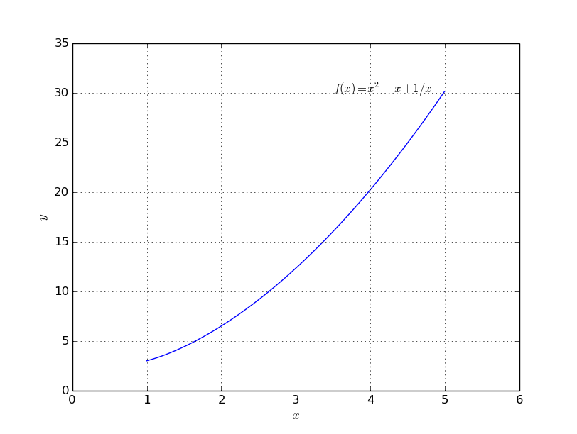

Volumen bei Rotation um die :math:`x`-Achse
===========================================

.. only:: html

    .. sidebar:: Hinweis

        Das Original dieser Maxima-Beispielaufgabe kann im Original `hier
        <http://www.lungau-academy.at/wxmax1001/D1003_F_AG_Volumen_Rotation_um_x_Achse.wxmx>`_
        heruntergeladen werden. Die wxmx-Datei kann mit `WxMaxima
        <http://wiki.ubuntuusers.de/Maxima>`_ geöffnet werden.

Bei dieser Aufgabe geht es um eine Volumensberechnung beziehungsweise um die
Berechnung eines bestimmten Integrals

*Aufgabe:*

Das Volumen eines Rotationskörpers soll berechnet werden. Gegeben sind die
erzeugende Funktion, die Untergrenze und die Obergrenze des Intervalls. Die
Rotation soll um die :math:`x`-Achse erfolgen. Die Aufgabe soll für die
Funktion :math:`f(x) = x^2 + x + \frac{1}{x}` gelöst werden, wobei die
Untergrenze bei :math:`a=1` und die Obergrenze bei :math:`b=5` liegen soll.

*Lösung:*

Der Graph der Funktion :math:`f(x) = x^2 + x + \frac{1}{x}` kann mit Hilfe von
`numpy <http://docs.scipy.org/doc/numpy/reference/>`_ und der `matplotlib
<http://matplotlib.org/api/index.html>`_ geplottet werden:

.. code-block:: python

    import matplotlib as mpl
    import matplotlib.pyplot as plt
    import numpy as np

    # Wertereihen erzeugen:
    x = np.arange(start=1,stop=5, step=0.01)
    y = x**2 + x + 1/x

    # Funktion plotten:
    plt.plot(x,y)

    # Layout anpassen:
    plt.axis([0,6,0,35])
    plt.xlabel("$x$")
    plt.ylabel("$y$")
    plt.grid(True)

    plt.text(3.5, 30, "$f(x)=x^2 + x + 1/x$")

    plt.show()

Das Ergebnis sieht folgendermaßen aus:

    Graph der Funktion :math:`f(x) = x^2 + x + \frac{1}{x}`.

Um das Volumen des aus :math:`f(x)` bei Rotation um die :math:`x`-Achse
entstehenden  Rotionskörpers zu berechnen, kann man sich diesen aus lauter
winzig schmalen (Zylinder-)Scheiben zusammengesetzt denken. Jede dieser Scheiben
hat als Radius den Wert :math:`f(x)`, als Höhe den Wert :math:`\mathrm{d} x`
und als Volumen somit :math:`\pi \cdot r^2 \cdot h = \pi \cdot f(x)^2 \cdot
\mathrm{d}x`. Alle diese infinitesimalen Volumina müssen aufsummiert werden,
was folgendem Integral entspricht:

.. math::

    V = \int_{a}^{b} \left( \pi \cdot f^2(x) \right) \cdot \mathrm{d} x =
    \int_{1}^{5} \pi \cdot \left( x^2 + x + \frac{1}{x} \right)^2 \cdot
    \mathrm{d} x

Dieses Integral kann mittels :ref:`Sympy <Sympy>` berechnet werden. Der Code
dazu lautet folgendermaßen:

.. code-block:: python

    import sympy as sy

    # Sympy-Variablen initiieren:
    x    = sy.S( 'x' )
    a, b = sy.S( [1, 5] )

    # Bestimmtes Integral berechnen:
    sy.integrate( sy.pi * (x**2 + x + 1/x) , (x,a,b) )

    # Ergebnis: 15164*pi/15

    # Alternativ: Ergebnis als Fließkommazahl ausgeben:
    sy.integrate( sy.pi * (x**2 + x + 1/x) , (x,a,b) ).evalf()

    # Ergebnis: 3175.94073326904

Das Volumen des Rotationskörpers beträgt somit rund :math:`3174,94`
Volumeneinheiten.

