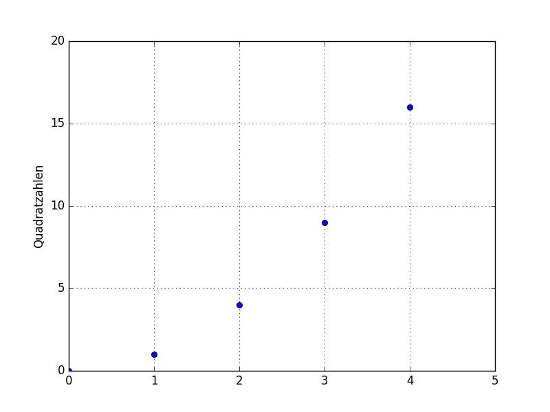
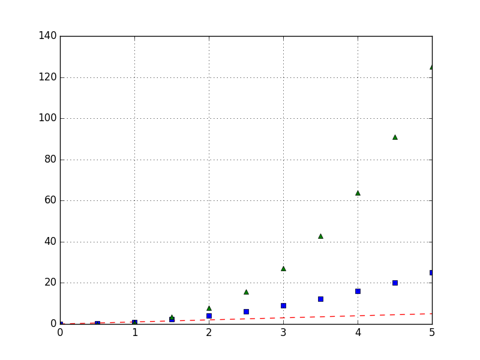
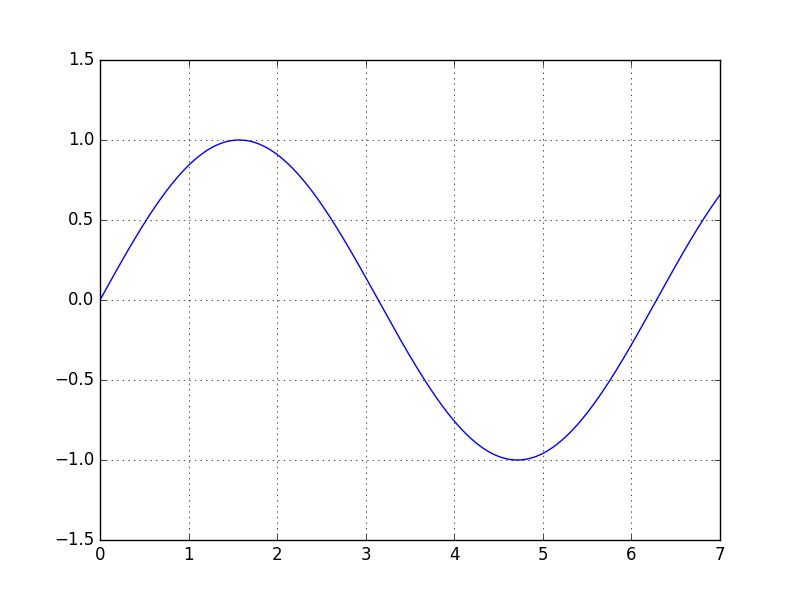
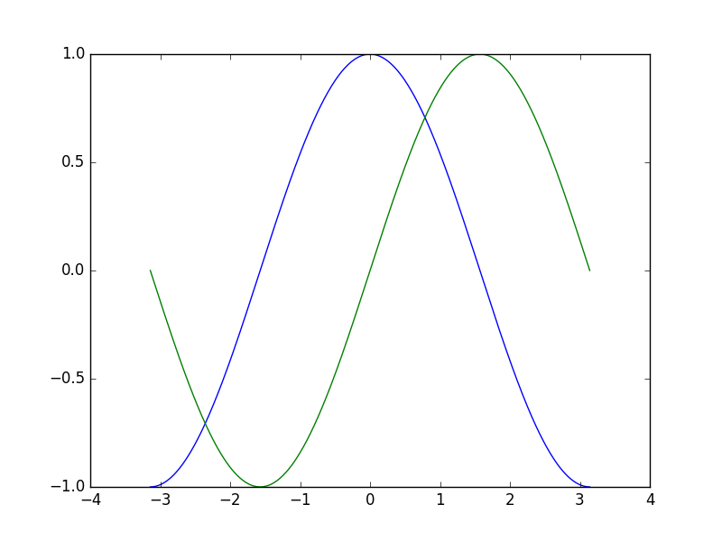
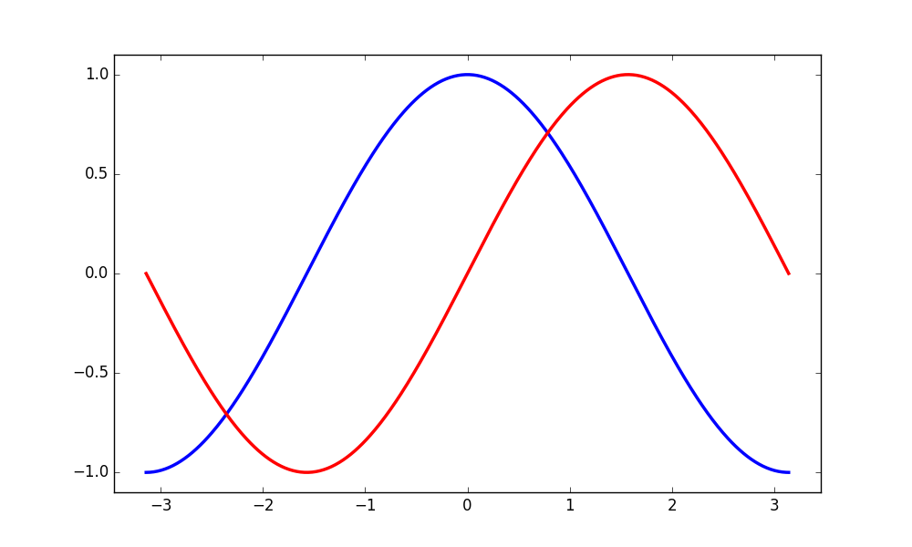
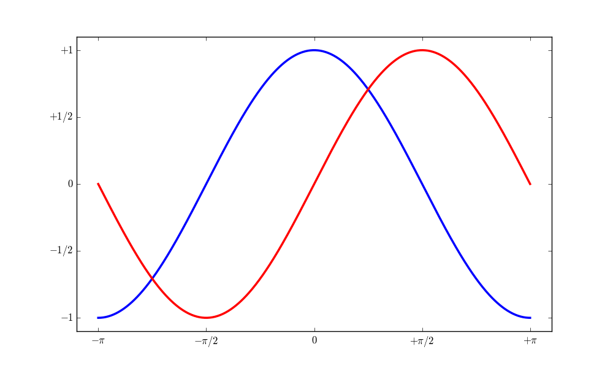
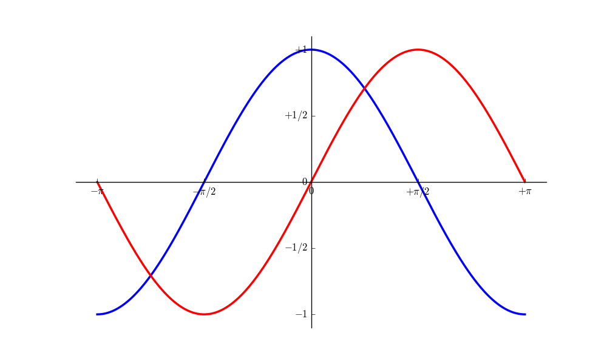
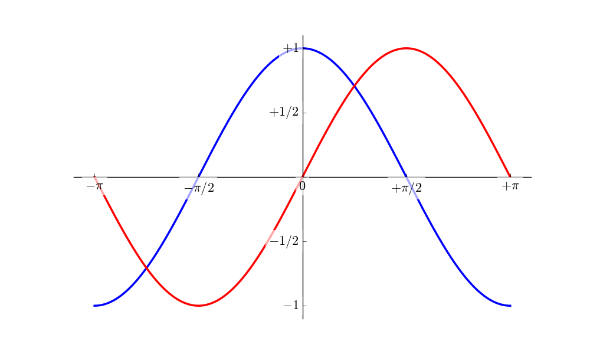
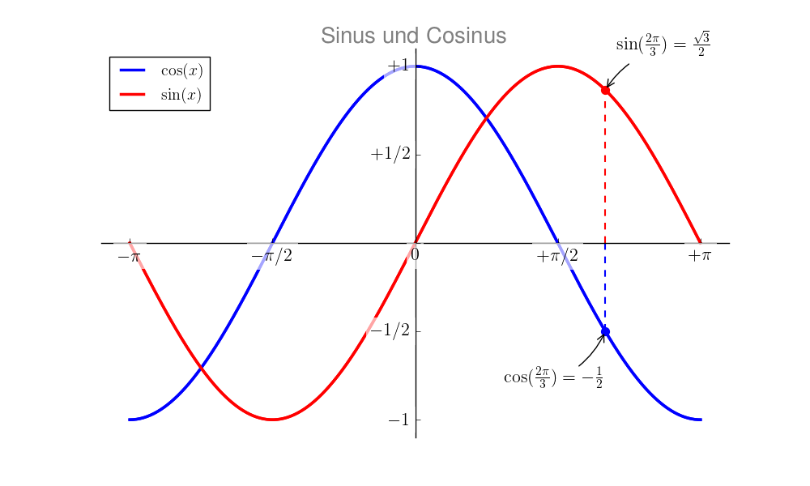

.. index:: Matplotlib
.. _matplotlib:
.. _matplotlib -- ein Plotter für Diagramme:

``matplotlib`` -- ein Plotter für Diagramme
===========================================

Die `Matplotlib <http://matplotlib.org/contents.html>`__ ist eine umfangreichste
Bibliothek, mit deren Hilfe verschiedene Diagrammtypen wie Linien-, Stab- oder
Kuchendiagramme, Histogramme, Boxplots, Kontourdiagramme, aber auch
dreidimensionale Diagramme und Funktionenplots auf einfache Weise erstellt
werden können.

Die Matplotlib ist nicht im Python3-Standard enthalten und muss daher
nachinstalliert werden :

.. code-block:: python

    sudo aptitude install python3-matplotlib python3-tk

    # oder easy_install3 matplotlib nach Installation von python3-setuptools

.. zusätzlich ffmpeg/mencoder und imagemagick sinnvoll, um Animationen als Filme
.. oder GIFs zu erstellen

Das zweite Paket ist notwendig, um geplottete Diagramme in einer graphischen
Bedienoberfläche anzeigen zu können.

.. index:: Liniendiagramme
.. _Liniendiagramme:
.. _Liniendiagramme erstellen:
.. _Liniendiagramme mit plot() erstellen:

Liniendiagramme mit ``plot()`` erstellen
----------------------------------------

Die Matplotlib kann mittels
``import matplotlib`` eingebunden werden; da der Name sehr lang ist, empfiehlt
sich beispielsweise folgende Abkürzung:

.. code-block:: python

    import matplotlib as mlp
    import matplotlib.pyplot as plt

Das erste Paket ist nützlich, um Einstellungen für die Matplotlib vorzunehmen;
das zweite beinhaltet unter anderem die wichtige ``plot()``-Funktion, die zum
Erstellen von 2D-Graphiken genutzt werden kann:

.. code-block:: python

    # Label für die y-Achse vergeben:
    plt.ylabel('Quadratzahlen')

    # Einen x-y-Plot erstellen:
    plt.plot([1,2,3,4], [1,4,9,16], 'bo')

    # Achsen-Bereiche manuell festlegen
    # Syntax: plt.axis([xmin, xmax, ymin, ymax])
    plt.axis([0, 5, 0, 20])

    # Ein gepunktetes Diagramm-Gitter einblenden:
    plt.grid(True)

    # Diagramm anzeigen:
    plt.show()

Durch einen Aufruf von ``plt.show()`` wird das zuvor definierte Diagramm in
einem graphischen Ausgabefenster angezeigt:

Schließt man das Ausgabefenster wieder (beispielsweise durch Drücken von ``Ctrl
w``), so kann man mit der Ipython-Sitzung fortfahren.

.. _Optionen für Diagramm-Linien:

Optionen für Diagramm-Linien
^^^^^^^^^^^^^^^^^^^^^^^^^^^^

Wie man im obigen Beispiel sieht, gibt es zahlreiche Möglichkeiten, das Aussehen
des Diagramms zu beeinflussen:

* Mit ``plt.axis( [xmin,xmax,ymin,ymax] )`` kann der Wertebereich der
  Achsen manuell festgelegt werden.

* Mit ``plt.grid(True)`` wird ein zur Achsen-Skalierung passendes Gitter als
  Diagramm-Hintergrund eingezeichnet.

* | Mit ``plt.xscale('log')`` wird die :math:`x`-Achse logarithmisch skaliert.
  | Mit ``plt.yscale('log')`` wird entsprechend die :math:`y`-Achse logarithmisch skaliert.

* | Mit ``plt.xlabel('Text')`` kann die :math:`x`-Achse des Diagramms
    beschriftet werden.
  | Mit ``plt.ylabel('Text')`` wird entsprechend die :math:`y`-Achse beschriftet.

* Mit ``plt.title('Text')`` kann eine Überschrift über das Diagramm drucken.

Beim Setzen von derartigen Optionen für ein Diagramm muss prinzipiell nicht auf
die Reihenfolge geachtet werden; es kann allerdings eine existierende Optionen
durch eine später eingegebene Option überschrieben (oder korrigiert) werden.

Die Funktion ``plt.plot()`` bietet bereits selbst einige Einstellungsmöglichkeiten:

* Wird ``plt.plot()`` mit nur einer Zahlen-Liste als Argument aufgerufen, so
  werden diese automatisch durchnummeriert (beginnend mit ``0``); für die
  :math:`x`-Achse wird dann diese Nummerierung als Wertebereich verwendet.

* Wird ``plt.plot()`` mit Zahlen-Listen als Argument aufgerufen, so
  wird die erste Liste als Wertebereich der :math:`x`-Achse und die zweite Liste
  als Wertebereich der :math:`y`-Achse angesehen.

* Zusätzlich zu der oder den Zahlen-Listen kann der Funktion ``plt.plot()`` als
  letztes Argument eine Zeichenkette übergeben werden, welche die Farbe und Form
  der Diagramm-Linie festlegt:

  - *Zu Beginn* dieser Zeichenkette kann die *Farbe* der Diagrammlinie
    festgelegt werden:

    +--------+-------------+
    | Symbol | Farbe       |
    +--------+-------------+
    | ``b``  | ``blue``    |
    +--------+-------------+
    | ``c``  | ``cyan``    |
    +--------+-------------+
    | ``g``  | ``green``   |
    +--------+-------------+
    | ``m``  | ``magenta`` |
    +--------+-------------+
    | ``r``  | ``red``     |
    +--------+-------------+
    | ``y``  | ``yellow``  |
    +--------+-------------+
    | ``k``  | ``black``   |
    +--------+-------------+
    | ``w``  | ``white``   |
    +--------+-------------+

  - *Am Ende* dieser Zeichenkette kann die *Form* der Diagrammlinie
    festgelegt werden:

    +--------+--------------------------------------------------------+
    | Symbol | Form                                                   |
    +--------+--------------------------------------------------------+
    | ``-``  | Durchgezogene Linie                                    |
    +--------+--------------------------------------------------------+
    | ``--`` | Gestrichelte Linie                                     |
    +--------+--------------------------------------------------------+
    | ``-.`` | Abwechselnd gestrichelte und gepunktete Linie          |
    +--------+--------------------------------------------------------+
    | ``:``  | Gepunktete Linie                                       |
    +--------+--------------------------------------------------------+
    | ``o``  | Einzelne Punkte, Darstellung als farbige Kreise        |
    +--------+--------------------------------------------------------+
    | ``s``  | Einzelne Punkte, Darstellung als farbige Rechtecke     |
    +--------+--------------------------------------------------------+
    | ``D``  | Einzelne Punkte, Darstellung als Diamant-Form          |
    +--------+--------------------------------------------------------+
    | ``^``  | Einzelne Punkte, Darstellung als farbige Dreiecke      |
    +--------+--------------------------------------------------------+
    | ``x``  | Einzelne Punkte, Darstellung als farbige ``x``-Zeichen |
    +--------+--------------------------------------------------------+
    | ``*``  | Einzelne Punkte, Darstellung als farbige ``*``-Zeichen |
    +--------+--------------------------------------------------------+
    | ``+``  | Einzelne Punkte, Darstellung als farbige ``+``-Zeichen |
    +--------+--------------------------------------------------------+

  Es ist auch möglich, beispielsweise mittels ``'b'`` nur die Linienfarbe auf
  ``blue`` oder mittels ``'--'`` nur die Linienform als gestrichelte Linie
  festzulegen.

* Als Alternative zu der zuletzt genannten Festlegung von Farbe und Form einer
  Diagrammlinie kann für das obige Beispiel auch folgende explizite Syntax
  gewählt werden:

  .. code-block:: python

      plt.plot([1,2,3,4], [1,4,9,16], color='blue', linestyle='', marker='o')

  Diese Syntax ist zwar mit mehr Schreibarbeit verbunden, ermöglicht es
  allerdings, beispielsweise bei einem Linien-Plot mit einem weiteren Attribut
  ``linewith=2.0`` die Linienstärke auf den doppelten Wert zu setzen.

.. _Diagramme mit mehreren Linien:

.. rubric:: Diagramme mit mehreren Linien

Möchte man mehrere Linien in einem einzelnen Diagramm darstellen, so muss man
lediglich die Funktion ``plt.plot()`` mehrfach mit den jeweiligen Wertelisten
aufrufen -- alle Linien werden dadurch in das selbe Diagramm geplottet. Erst
durch eine Eingabe von ``plt.show()`` wird das fertige Diagramm auf dem
Bildschirm ausgegeben.

*Beispiel:*

.. code-block:: sh

    # Wertebereich für x-Achse festlegen:
    x = [0, 0.5, 1.0, 1.5, 2.0, 2.5, 3.0, 3.5, 4.0, 4.5, 5.0]

    x2 = [num**2 for num in x]
    x3 = [num**3 for num in x]

    # Einzelne Diagramm-Linien plotten:
    plt.plot(x, x, 'r--')
    plt.plot(x, x2,'bs')
    plt.plot(x, x3,'g^')

    # Diagramm-Gitter einblenden:
    plt.grid(True)

    # Diagramm ausgeben:
    plt.show()

*Ergebnis:*

.. _Diagramme speichern:

Diagramme speichern
^^^^^^^^^^^^^^^^^^^

Um ein Diagramm als Graphik-Datei abzuspeichern, kann man einfach im
Ausgabe-Fenster auf das "Save Figure"-Icon klicken und im erscheinenden Fenster
einen Dateinamen eingeben und den gewünschten Zielpfad wählen:

Eine andere Möglichkeit besteht darin, das Diagramm **vor** einem Aufruf von
``plt.show()`` mittels folgender Anweisung zu speichern:

.. code-block:: python

    # Speichern als PNG-Datei:
    plt.savefig('/pfad/dateiname.png')

    # Speichern als SVG-Datei:
    plt.savefig('/pfad/dateiname.png', format='svg')

Ist der Aufruf von ``plt.show()`` beendet, so verfällt nämlich das bisherige
Diagramm mitsamt allen dafür getroffenen Festlegungen. Dies hat einerseits den
Vorteil, dass man unmittelbar mit der Eingabe des nächsten Diagramms beginnen
kann, ohne die Einstellungen erst zurücksetzen zu müssen. Andererseits ist ein
Ändern des bisherigen Diagramms nur möglich, indem man die bisherigen Eingaben
über die History-Funktion des Interpreters (:math:`\uparrow`-Taste) zurückholt
und als Vorlage für ein neues Diagramm nimmt.

.. _Zahlenbereiche als Werte-Listen:

Zahlenbereiche als Werte-Listen
^^^^^^^^^^^^^^^^^^^^^^^^^^^^^^^

Anstelle einer Zahlenliste kann der Funktion ``plt.plot()`` auch eine
beziehungsweise zwei Zahlenbereiche übergeben werden, die beispielsweise mittels
:ref:`np.arange() <numpy.arange()>` oder ``np.linspace()`` aus dem :ref:`numpy
<numpy>`-Modul generiert wurden. Dies hat den Vorteil, dass man mit einer sehr
guten Rechen-Performance die Wertebereiche in sehr kleine Schritte unterteilen
kann und die erstellten Linien somit nahezu "glatt" erscheinen:

*Beispiel:*

.. code-block:: python

    import numpy as np

    # Werte-Listen für Sinus-Funktion generieren:
    x = np.arange(0, 10, 0.01)  # Start, Stop, Step
    y = np.sin(x)

    # Sinus-Kurve plotten:
    plt.plot(x, y)
    plt.axis( [0, 7, -1.5, 1.5] )
    plt.grid(True)
    plt.show()

*Ergebnis:*

.. _Anpassung von Matplotlib-Diagrammen:

Anpassung von Matplotlib-Diagrammen
-----------------------------------

Matplotlib-Diagramme haben allgemein folgenden Aufbau:

.. figure:: pics/matplotlib-diagramm-aufbau.png
    :name: fig-matplotlib-figure
    :alt:  fig-matplotlib-figure
    :align: center
    :width: 45%

    Allgemeiner Aufbau eines Matplotlib-Diagramms (Quelle:
    `Matplotlib-Dokumentation <http://matplotlib.org/faq/usage_faq.html>`__

Die Basis eines jeden Diagramms ist also ein ``Figure``-Objekt (mit möglichem
Titel), das eigentliche Diagramm wird durch den Wertebereich der Achsen
(``axes``) festgelegt. Insbesondere muss zwischen ``axes`` und ``axis``
unterschieden werden: Die letztere Bezeichnung bezieht sich nur auf entweder die
:math:`x`- oder die :math:`y`-Achse.

Anhand des Sinus-Plots aus dem letzten Abschnitt soll im folgenden Beispiel
gezeigt werden, wie man mittels der obigen Objekte das Aussehen eines
Matplotlib-Diagramms anpassen beziehungsweise verbessern kann. [#]_

.. code-block:: python

    import numpy as np
    import matplotlib.pyplot as plt

    # Werte-Listen für eine Sinus- und Cosinus-Funktion erstellen:
    x = np.linspace(-np.pi, np.pi, 500, endpoint=True)
    cos_x = np.cos(x)
    sin_x = np.sin(x)

    # Diagramm-Linien plotten:
    plt.plot(x, cos_x)
    plt.plot(x, sin_x)

    # Diagramm anzeigen:
    plt.show()

Mit der obigen Plot-Anweisung erhält man -- ohne weitere Einstellungen --
folgendes Diagramm:

    Sinus- und Cosinus-Plot mit Basis-Einstellungen

    .. only:: html

        :download:`PY: Sinus und Cosinus 1
        <sinus-und-cosinus-1.py>`

Auf diese Weise kann man sich mit sehr wenig Aufwand ein Bild von einer
mathematischen Funktion verschaffen. Dass nur eine minimale Code-Menge nötig
ist, liegt auch daran, dass in den Matplotlib-Funktionen für viele Einstellungen
Standard-Werte vorgegeben sind. Würde man alle diese Werte explizit angeben, so
würde das obige Code-Beispiel folgendermaßen aussehen:

.. :emphasize-lines: 2,3

.. code-block:: python
    :linenos:

    # Module importieren
    import numpy as np
    import matplotlib.pyplot as plt

    # Werte-Listen für eine Sinus- und Cosinus-Funktion erstellen:
    x = np.linspace(-np.pi, np.pi, 500, endpoint=True)
    cos_x = np.cos(x)
    sin_x = np.sin(x)

    # Eine neues Matplot-Figure-Objekt mit 8x6 Zoll und
    # einer Auflösung von 100 dpi erstellen:
    plt.figure(figsize=(8, 6), dpi=80)

    # In diese Abbildung ein 1x1 großes Diagramm-Gitter erstellen;
    # Als aktuelles Diagramm wird das erste dieses Gitters ausgewählt:
    plt.subplot(111)

    # Cosinus-Funktion mit blauer Farbe, durchgehender Linie und 1 Pixel
    # Linienbreite plotten:
    plt.plot(x, cos_x, color="blue", linewidth=1.0, linestyle="-")

    # Sinus-Funktion mit grüner Farbe, durchgehender Linie und 1 Pixel
    # Linienbreite plotten:
    plt.plot(x, sin_x, color="green", linewidth=1.0, linestyle="-")

    # Grenzen für die x-Achse festlegen:
    plt.xlim(-4.0, 4.0)

    # Grenzen für die y-Achse festlegen:
    plt.ylim(-1.0, 1.0)

    # "Ticks" (Bezugspunkte) für x-Achse festlegen:
    plt.xticks(np.linspace(-4, 4, 9,endpoint=True))

    # "Ticks" (Bezugspunkte) für y-Achse festlegen:
    plt.yticks(np.linspace(-1, 1, 5,endpoint=True))

    # Diagramm anzeigen:
    plt.show()

Die Ausgabe dieses Codes ist mit dem obigen Diagramm absolut identisch. Man kann
dieses "ausführlichere" Code-Beispiel allerdings sehr gut als Ausgangsbasis für
verschiedene Anpassungen verwenden.

.. _Größe, Farben und Grenzen anpassen:

.. rubric:: Größe, Farben und Grenzen anpassen

Das ursprüngliche Diagramm erscheint bei der Original-Größe (:math:`8 \times 6`
Zoll) in vertikaler Richtung stark gestreckt; im Fall der Sinus- und
Cosinus-Funktion, deren Wertebereich nur zwischen :math:`-1` und :math:`+1`
liegt, ist wohl ein eher breiteres Diagramm besser geeignet. Hierzu kann man im
obigen Code-Beispiel die Zeile ``12`` durch folgende Zeile ersetzen:

.. code-block:: python

    # Größe des Plots anpassen:
    plt.figure(figsize=(10,6), dpi=80)

Die Linien werden im ursprünglichen Diagramm zudem mit einer Linienbreite von
nur :math:`\unit[1]{px}` gedruckt. Würde man dieses Diagramm beispielsweise mit
einem Schwarz-Weiß-Drucker drucken (und die gedruckte Seite womöglich
anschließend noch kopieren), so wären die Linien nicht mehr gut zu erkennen --
zudem hätten die Linien ähnliche Grau-Werte. Um dies zu verbessern, kann man im
obigen Code-Beispiel die Zeilen ``20`` und ``24`` durch folgende Zeilen
ersetzen:

.. code-block:: python

    # Farbe und Dicke der Diagrammlinien anpassen:
    plt.plot(x, cos_x, color='blue', linewidth=2.5, linestyle='-')
    plt.plot(x, sin_x, color='red',  linewidth=2.5, linestyle='-')

Gibt man zudem keinen Wertebereich für die :math:`x`- und :math:`y`-Achse an,
verwendet die Matplotlib einfach die Minima und Maxima der darzustellenden Werte
als Diagramm-Grenzen (zum betraglich nächst größeren Integer-Wert aufgerundet);
die Diagramm-Linie stößt somit an den Diagramm-Grenzen an. Möchte man hier einen
"weicheren" Übergang, also nicht anstoßende Diagrammlinien, so kann ein
geringfügig größerer Wertebereich für die Diagramm-Grenzen gewählt werden.
Hierzu kann man im obigen Code-Beispiel die Zeilen ``27`` und ``30`` durch
folgende Zeilen ersetzen:

.. code-block:: python

    # Wertebereiche der Achsen anpassen:
    plt.xlim(x.min()*1.1, x.max()*1.1)
    plt.ylim(cos_x.min()*1.1, cos_x.max()*1.1)

Mit diesen Anpassungen erhält man bei einem Aufruf von ``plt.show()`` nun
folgendes Diagramm:

    Sinus- und Cosinus-Plot mit anderen Farb- und Größenanpassung.

    .. only:: html

        :download:`PY: Sinus und Cosinus 2
        <sinus-und-cosinus-2.py>`

.. _Ticks anpassen:
.. _Bezugspunkte anpassen:
.. _"Ticks" (Bezugspunkte) für die Achsen anpassen:

.. rubric:: "Ticks" (Bezugspunkte) für die Achsen anpassen:

Zur Darstellung der trigonometrischen Funktionen ist die gewöhnliche Skalierung
der :math:`x`-Achse nicht ideal: Man kann damit beispielsweise nur
näherungsweise ablesen, an welchen Stellen die Funktionen Nullstellen oder
Maxima haben. Praktischer wäre es, die Skalierung der :math:`x`-Achse anhand der
Kreiszahl :math:`\pi` festzulegen. Hierzu kann man im obigen Code-Beispiel die
Zeile ``33`` durch folgende Zeile ersetzen:

.. code-block:: python

    # Auf der x-Achse fünf Bezugspunkte (als Vielfache von pi) festlegen:
    plt.xticks( [-np.pi, -np.pi/2, 0, np.pi/2, np.pi] )

Plottet man das so abgeänderte Diagramm, so bekommt man auf der :math:`x`-Achse
die numerischen Werte angezeigt, also beispielsweise ``3.142`` anstelle von
:math:`\pi`. Glücklicherweise kann man beim Aufruf von ``plt.xticks()`` nicht
nur die Position der Ticks, sondern durch Angabe einer zweiten Liste auch ihre
Beschriftung festlegen, und hierfür optional auch :ref:`LaTeX-Formelzeichen
<gwil:Mathematischer Formelsatz>` nutzen:

.. code-block:: python

    # Auf der x-Achse fünf Bezugspunkte (als Vielfache von pi) festlegen
    # und mittels LaTeX-Symbolen beschriften:
    plt.xticks( [-np.pi, -np.pi/2, 0, np.pi/2, np.pi],
                [ r'$-\pi$', r'$-\pi/2$', r'$0$', r'$+\pi/2$', r'$+\pi$']
        )

    # Auch Ticks für die y-Achse anpassen:
    plt.yticks( [-1.0, -0.5, 0, 0.5, 1],
                [ r'$-1$', r'$-1/2$', r'', r'$+1/2$', r'$+1$']
        )

Das ``r`` vor den einzelnen Zeichenketten bewirkt, dass diese als ``raw``
angesehen werden, also Sonderzeichen wie ``$`` nicht mit einem zusätzlichen
``\``-Zeichen versehen werden müssen.

Im obigen Beispiel wurde auch die Beschriftung der :math:`y`-Achse angepasst,
damit die Schriftart identisch ist. Als Ergebnis erhält man bei einem Aufruf von
``plt.show()`` damit folgendes Diagramm:

    Sinus- und Cosinus-Plot mit Anpassung der Achsenbeschriftung.

    .. only:: html

        :download:`PY: Sinus und Cosinus 3
        <sinus-und-cosinus-3.py>`

.. _Diagramm-Achsen verschieben:

.. rubric:: Diagramm-Achsen verschieben:

Das Achsen-Objekt ``axes`` eines Diagramms hat eine Eigenschaft, die mit
``spines`` bezeichnet wird; darin wird festgelegt, an welcher Stelle die Achsen
dargestellt werden sollen. Standardmäßig wird in der Matplotlib die
:math:`y`-Achse am linken Rand des Diagramms gedruckt. Dies hat den Vorteil,
dass man auch den rechten Rand für das zusätzliche Plotten einer zweiten Kurve
als Werte-Achse nutzen kann, sofern sich die Wertebereiche beider Linien stark
voneinander unterscheiden.

Soll allerdings, beispielsweise für Kurvendiskussionen oder geometrische
Aufgaben üblich, ein Koordinatensystem mit vier Quadranten gezeichnet werden, so
ist bisweilen ein Diagramm mit einem in der Mitte liegenden Nullpunkt und zwei
durch diesen verlaufenden :math:`x`- beziehungsweise  :math:`y`-Achsen besser
geeignet. Dazu müssen die Achsen in die Mitte "verschoben" werden.. Man kann
dies erreichen, indem man zwei der vier ``spines`` (links, rechts, oben, unten)
entfernt und die anderen beiden in die Mitte verschiebt. Hierzu kann man im
obigen Code-Beispiel folgende Zeilen vor der Anweisung  ``plt.show()`` einfügen:

.. code-block:: python

    # Das Achsen-Objekt des Diagramms in einer Variablen ablegen:
    ax = plt.gca()

    # Die obere und rechte Achse unsichtbar machen:
    ax.spines['right'].set_color('none')
    ax.spines['top'].set_color('none')

    # Die linke Diagrammachse auf den Bezugspunkt '0' der x-Achse legen:
    ax.spines['left'].set_position(('data',0))

    # Die untere Diagrammachse auf den Bezugspunkt '0' der y-Achse legen:
    ax.spines['bottom'].set_position(('data',0))

    # Ausrichtung der Achsen-Beschriftung festlegen:
    ax.xaxis.set_ticks_position('bottom')
    ax.yaxis.set_ticks_position('left')

Als Ergebnis erhält man damit bei einem Aufruf von ``plt.show()`` folgendes
Diagramm:

    Sinus- und Cosinus-Plot mit anderer Positionierung der Achsen.

    .. only:: html

        :download:`PY: Sinus und Cosinus 4
        <sinus-und-cosinus-4.py>`

Diese Darstellungsform ist zwar elegant, doch werden in diesem Fall die
Beschriftungen der :math:`x`- und :math:`y`-Achse teilweise durch die
Funktionsgraphen verdeckt. Als Workaround kann man einerseits Schriftgröße der
Achsenbeschriftung ändern, und andererseits diese durch eine halb-transparente
Umrandung hervorheben. Hierzu kann man folgenden Code vor der Anweisung
``plt.show()`` einfügen:

.. code-block:: python

    # Achse-Beschriftungen durch weiß-transparenten Hintergrund hervorheben:
    for label in ax.get_xticklabels() + ax.get_yticklabels():
        label.set_fontsize(16)
        label.set_bbox(dict(facecolor='white', edgecolor='None', alpha=0.65 ))

Als Ergebnis erhält man damit durch einen Aufruf von ``plt.show()``:

    Sinus- und Cosinus-Plot mit anderer Positionierung der Achsen und
    hervorgehobener Achsen-Bsechriftung.

    .. only:: html

        :download:`PY: Sinus und Cosinus 5
        <sinus-und-cosinus-5.py>`

.. _Titel, Legende und Text hinzufügen:

.. rubric:: Titel, Legende und Text hinzufügen

Normalerweise werden Diagramme bei der Textsatzung mit einer Bildunterschrift
("Caption") eingebunden; meist wird dabei auch eine Abbildungs-Nummer mit
eingefügt, so dass das Diagramm aus dem Text heraus eindeutig referenziert
werden kann. Erstellt man ein Diagramm hingegen für eine Pinnwand oder eine
Overhead-Folie / Beamer-Präsentation, so ist ein groß gedruckter Titel über dem
Diagramm bisweilen nützlich. Ein solcher kann folgendermaßen zum Diagramm
hinzugefügt werden:

.. code-block:: python

    # Titel hinzufügen:
    plt.title('Sinus und Cosinus', fontsize=20, color='gray')

Auch hier kann bei Bedarf wieder LaTeX-Code im Titeltext verwendet werden.

Als weitere Verbesserung ist es sehr nützlich, wenn in einem Diagramm mit
mehreren Linien als "Legende" angezeigt wird, welche Bedeutung die einzelnen
Linien haben. Hierzu kann man bei den einzelnen ``plt.plot()``-Anweisungen
zusätzlich einen ``label``-Parameter angeben und anschließend die Legende
mittels ``plt.legend()`` anzeigen:

.. code-block:: python

    # Plots mit einem Label versehen:
    plt.plot(x, cos_x, color="blue", linewidth=2.5, linestyle="-", label=r'$\cos(x)$')
    plt.plot(x, sin_x, color="red",  linewidth=2.5, linestyle="-", label=r'$\sin(x)$')

    # Legende einblenden:
    plt.legend(loc='upper left', frameon=True)

Als zusätzliche Beschriftung können noch weitere Text-Elemente in das Diagramm
aufgenommen werden. Besondere Stellen lassen sich zudem mit Pfeilen oder
Hilfslinien hervorheben.

.. code-block:: python

    # Hervorzuhebende Stelle festlegen:
    pos = 2*np.pi/3

    # Vertikale gestrichelte Linie an der Stelle 'pos' einzeichnen
    # (von der x-Achse bis zum Graph der cos-Funktion):
    plt.plot([pos,pos], [0,np.cos(pos)], color ='blue', linewidth=1.5, linestyle="--")

    # Punkt(e) auf der cos-Linie mit Marker versehen:
    # (Die x- und y-Werte müssen -- wie bei plot() -- als Liste angegeben werden)
    # (Mit s=50 wird die Größe ('size') auf 50 Pixel festgelegt)
    plt.scatter([pos], [np.cos(pos)], s=50, marker='o', color ='blue')

    # Eigenen Text einfügen:
    plt.annotate(r'$\sin(\frac{2\pi}{3}) = \frac{\sqrt{3}}{2}$',
                 xy=(pos, np.sin(pos)), xycoords='data',
                 xytext=(+10, +30), textcoords='offset points', fontsize=16,
                 arrowprops=dict(arrowstyle="->", connectionstyle="arc3, rad=.2"))

    # Vertikale gestrichelte Linie an der Stelle 'pos' einzeichnen
    # (von der x-Achse bis zum Graph der sin-Funktion):
    plt.plot([pos,pos], [0,np.sin(pos)], color ='red', linewidth=1.5, linestyle="--")

    # Punkt(e) auf der sin-Linie mit Marker versehen:
    plt.scatter([pos], [np.sin(pos)], s=50, marker='o', color ='red')

    # Eigenen Text einfügen:
    plt.annotate(r'$\cos(\frac{2\pi}{3}) = -\frac{1}{2}$',
                 xy=(pos, np.cos(pos)), xycoords='data',
                 xytext=(-90, -50), textcoords='offset points', fontsize=16,
                 arrowprops=dict(arrowstyle="->", connectionstyle="arc3, rad=.2"))

Damit erhält man schließlich das folgende Diagramm:

    Sinus- und Cosinus-Plot mit zusätzlichen Beschriftungen.

    .. only:: html

        :download:`PY: Sinus und Cosinus 6
        <sinus-und-cosinus-6.py>`

.. plt.subplot(211)
.. plt.plot(t1, f(t1), 'bo', t2, f(t2), 'k')

.. plt.subplot(212)
.. plt.plot(t2, np.cos(2*np.pi*t2), 'r--')
.. plt.show()

.. todo Text einfügen

... to be continued ...

.. interactive vs not interactive
.. qtconsole: magic function

.. %matplotlib inline

.. plt.plot( [1,3] )
.. Diagramm wird unmittelbar -- also ohne Aufruf von ``plt.show()`` -- in
.. qtconsole angezeigt.

.. rubric:: Links

* `Matplotlib-Gallery mit Code-Beispielen (en.) <http://matplotlib.org/gallery.html>`__

.. raw:: html

    

.. only:: html

    .. rubric:: Anmerkungen:

.. [#] Die Quelle zu diesem Tutorial (englischsprachig, ebenfalls unter einer
    Creative-Commons-License) stammt von Nicolas P. Rougier und ist Teil seines
    `Matplotlib-Tutorials
    <http://www.labri.fr/perso/nrougier/teaching/matplotlib/>`__.

